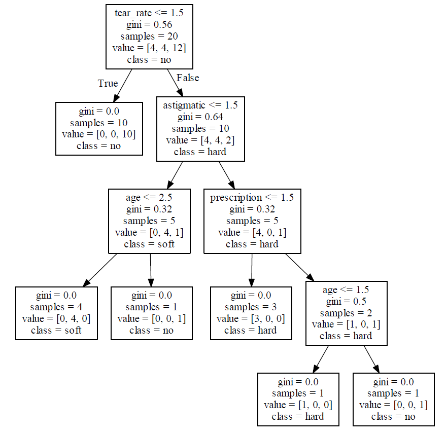

# 决策树
Yeslab人工智能公会教学项目。

## 项目描述
* 本项目为Yeslab人工智能公会的第一个教学项目，简单的决策树实验。  
* 本实验使用最基本的决策树，完成对二维数据的分类。
* 本实验为人工智能入门学生以及对人工智能感兴趣的朋友而设立，后续会更新更多的机器学习、计算机视觉以及强化学习等内容。

## 项目介绍
* 本项目由python语言进行开发，使用sklearn作为决策树主要算法支持库。
* 并采用pydot对sklearn输出文件进行可视化展示。

## 项目背景
* 如今眼疾病人十分普遍，每个人身边都有很多近视、远视、散光等眼疾患者。而随着社会发展，框架式眼镜逐渐被爱美人士抛弃，更多人青睐于隐形眼镜，然而大多数人几乎都不会在购买、佩戴隐形眼镜之前咨询医生，导致他们佩戴错误类型的隐形眼镜，进一步对自己的眼镜造成伤害，本项目以此为基础，使用专业数据训练机器学习系统并最终得到可以由个人使用的模型，通过运行本程序，相当于将专业眼疾医生放在个人电脑上，给予您专业的建议。
* 本项目使用决策树来对眼疾患者进行分类，利用离线数据训练决策树模型，通过训练好的模型可以让AI给予病人关于是否合适佩戴隐形眼镜的建议，以及告诉可以佩戴隐形眼镜的病人应当选择硬质地的隐形眼镜还是软质地的隐形眼镜。

## 数据
* 数据来源：[点此查看](http://archive.ics.uci.edu/ml/machine-learning-databases/lenses/)
* 数据描述：通过采集24位眼疾患者的相关数据，包含患者年龄、眼镜处方、是否散光、泪液产生率，并结合专家给出的三种分类结果（适合佩戴硬性隐形眼镜、适合佩戴软性隐形眼镜、不应配戴隐形眼镜）。
* 数据处理方式：由于数据已经做过预处理，本项目仅对数据进行分组，1-20 作为训练数据， 21-24作为测试数据。

## 模型
* 模型：本项目使用 sklearn.tree 作为模型算法库，并选用其中tree.DecisionTreeClassifier()这个API作为决策树算法模型，该算法模型默认使用二分类构建树结构。
* 算法：决策树对数据的分类依赖于对数据混杂度的判断，业界有两种算法可以计算数据混杂度：
 - 基尼不纯度: $I_G(p) = 1 - \sum^J_{i=1}p_i^2$
 - 信息熵:$H(T) = -\sum^J_{i=1}p_ilog_2p_i$
 - 公式描述：J 指数据分类的标签

## 训练过程
* 基本决策树仅为一次判断与学习，一次性建立树结构。
* 默认使用基尼不纯度作为数据混杂度计算方法。
* 所有参数均使用默认参数。

## 结果
经过训练后生成的决策树，最深可达5层，在测试数据集（4个测试数据）的测试准确率为75%，满足本项目需求，训练结果如下图所示。

## 总结
本项目对学生学习机器学习很有帮助，后续项目会进一步进行一些数据分析的实验。

## 后续工作
标准决策树仍然是一个并不完善的分类器，仅能对简单数据做简单分类，并不能有效利用数据特征，由标准决策树发展而来的机器学习技术有：
* Random Forest
* GBDT
* XGBOOST  
